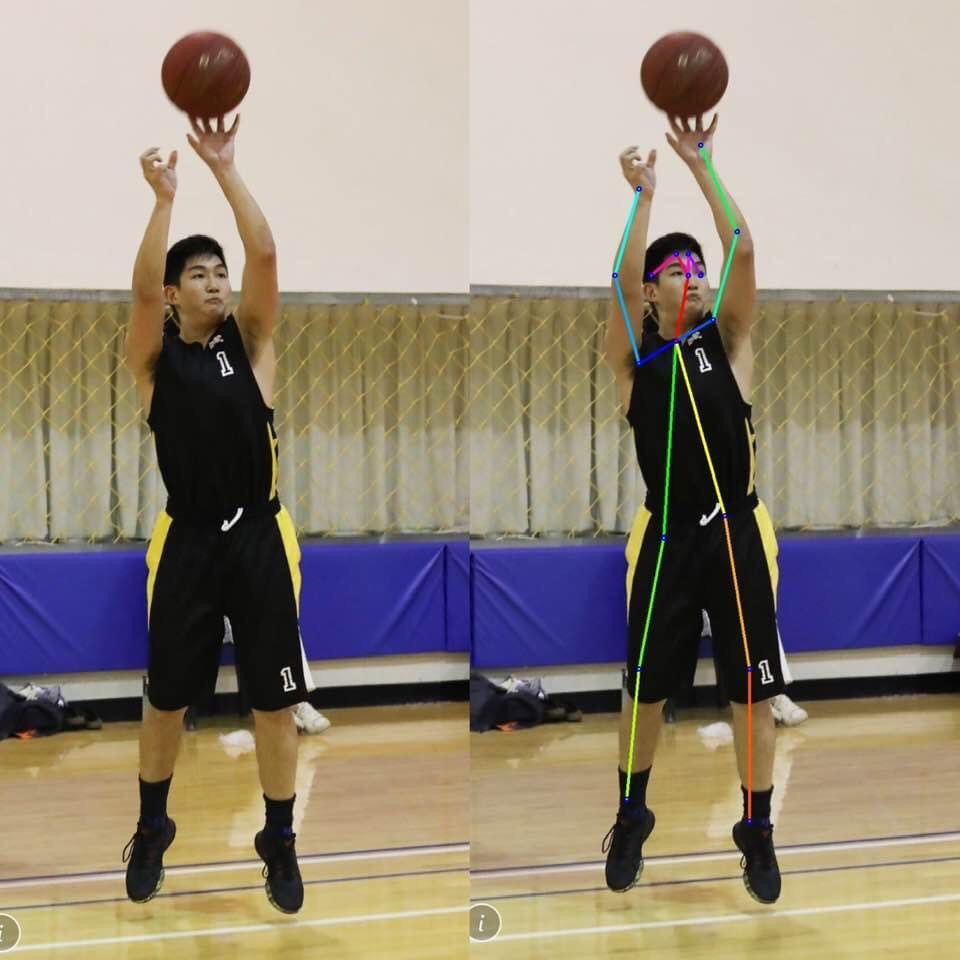
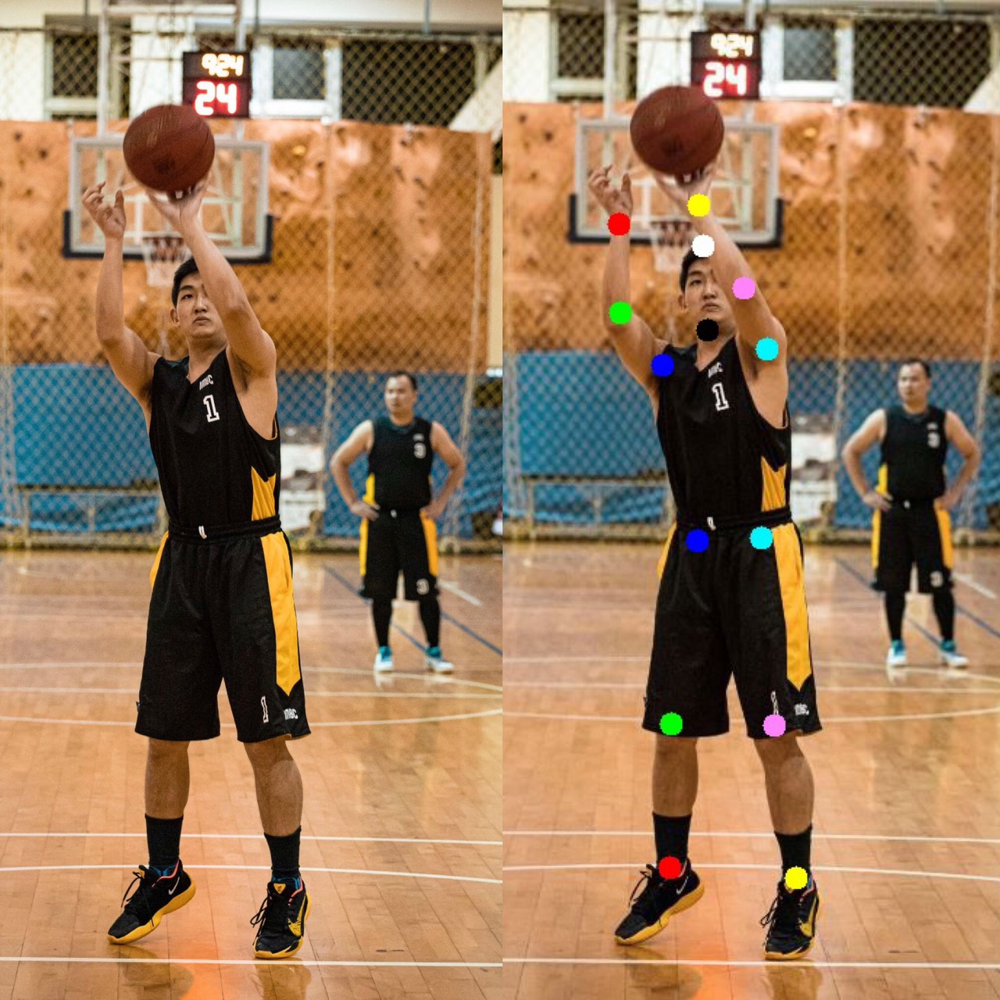

# Caffe-Human-Pose-joint-Detected
The project with Caffe Architecture using in Human-Pose detecting the predict joint in human body.

The project with Human-Pose and detecting the predict joint in human body.

1.Openpose Model : 
  - 19 Body-Joint-Detected 
  - Model : Caffemodel  
 

2.Deepcut Model : 
  - 15 Body-Joint-Detected 
  - Model : ResNet152/Caffemodel

